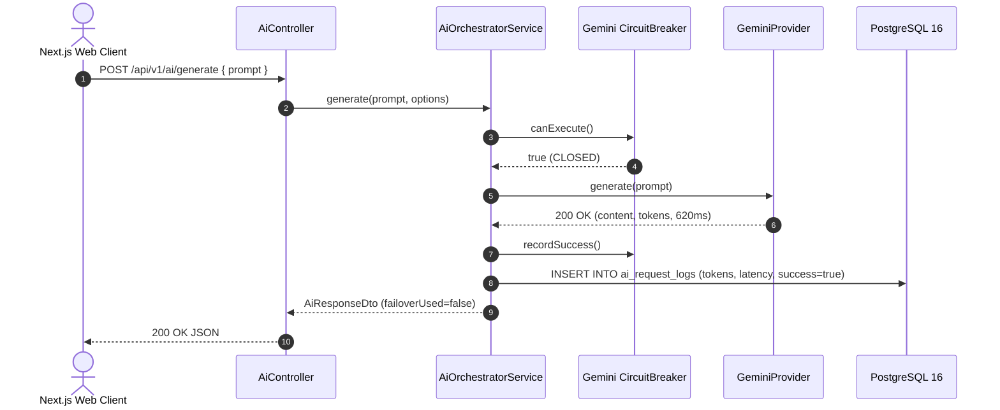
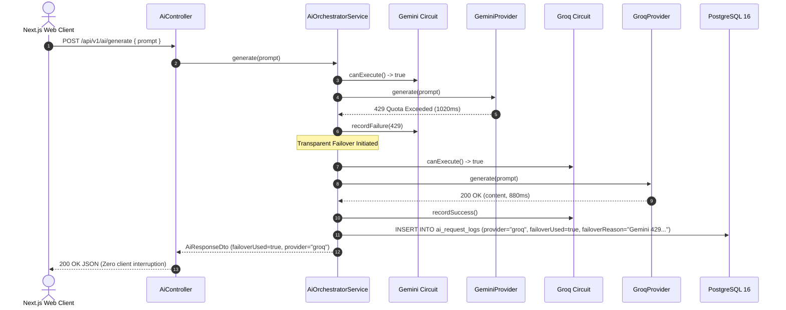
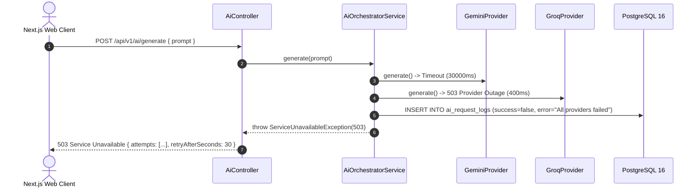
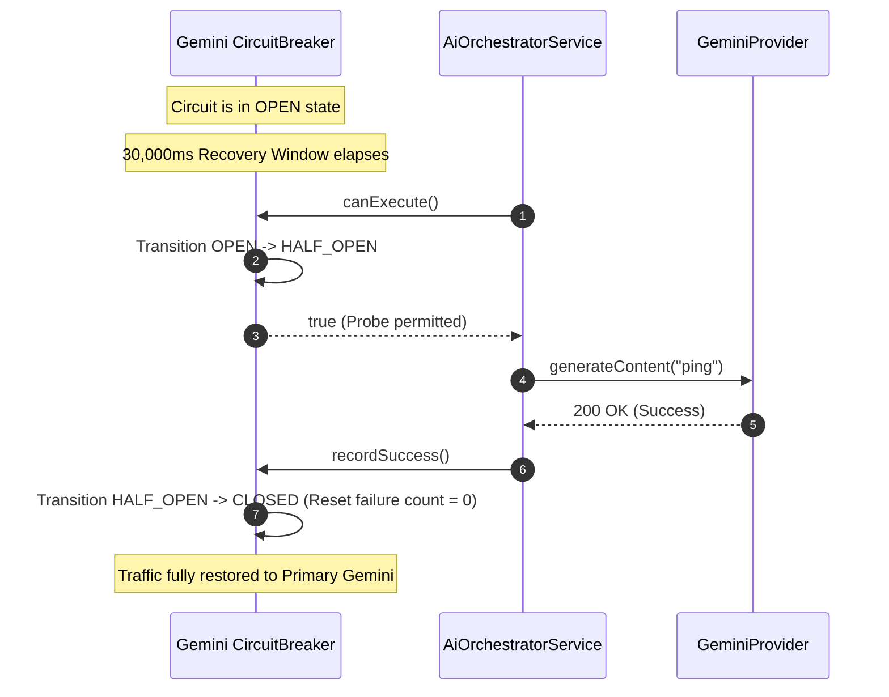

# Production-Grade Dual-Provider AI Integration Architecture
## NEO Employee Management System (EMS)

---

## 1. System Architecture Diagram

```
+---------------------------------------------------------------------------------------------------------+
|                                    Next.js 14+ Frontend Application                                     |
|  - Minimal High-Fidelity UI: /ai-assistant (Two Model Cards, Spacious Prompt Area, Result Output Panel) |
|  - Custom React Hooks: useAiCompletion(), useAiHealth()                                                 |
+---------------------------------------------------------------------------------------------------------+
                                                     │
                                        HTTPS /api/v1/ai (REST API)
                                                     ▼
+---------------------------------------------------------------------------------------------------------+
|                                    NestJS API Gateway Layer (Port 4000)                                 |
|  - Global Prefix: /api/v1                                                                               |
|  - Security: JwtAuthGuard, RolesGuard (RBAC/PBAC)                                                       |
|  - Rate Limiter: ThrottlerGuard (Redis-backed per-user limit)                                           |
|  - Swagger Documentation: /api/docs                                                                     |
|                                                                                                         |
|  ┌───────────────────────────────────────────────────────────────────────────────────────────────────┐  |
|  │                                          AiModule                                                 │  |
|  │                                                                                                   │  |
|  │   AiController (/api/v1/ai/generate, /health, /logs)                                              │  |
|  │        │                                                                                          │  |
|  │        ▼                                                                                          │  |
|  │   AiOrchestratorService ──────────────────────────────────────────────────────────────────────┐   │  |
|  │        │                                                                                      │   │  |
|  │        ├─► CircuitBreaker (State: CLOSED | OPEN | HALF_OPEN)                                  │   │  |
|  │        ├─► LatencyTracker (Rolling p50 / p95, Error Rates)                                    │   │  |
|  │        │                                                                                      │   │  |
|  │        ▼                                                                                      │   │  |
|  │   AIProviderFactory                                                                           │   │  |
|  │        ├── Primary: GeminiProvider (@google/generative-ai: gemini-1.5-flash)                  │   │  |
|  │        └── Secondary: GroqProvider (groq-sdk: llama-3.3-70b-versatile)                        │   │  |
|  │                                                                                               │   │  |
|  └───────────────────────────────────────────────────────────────────────────────────────────────┼───┘  |
+--------------------------------------------------------------------------------------------------┼------+
                                                                                                   │
                                                 Token-Level Audit Log Events                      │
                                                                                                   ▼
+------------------------------------------+                      +---------------------------------------+
|            Redis 7 / BullMQ              |                      |             PostgreSQL 16             |
|  - Queue: ai-processing                  |                      |  - Table: ai_request_logs             |
|  - Worker: ai.processor.ts               |                      |    (requestId, promptTokens, latency, |
|  - Long-running document summarization   |                      |     model, failoverUsed, error)       |
|  - Bulk completions & batch jobs         |                      |  - Table: audit_logs (Enterprise Log) |
+------------------------------------------+                      +---------------------------------------+
```

---

## 2. NestJS Module Structure & DI Wiring

```
apps/api/src/modules/ai/
├── ai.module.ts                         # Module imports, provider declarations, and exports
├── ai.controller.ts                     # HTTP routing with Swagger decorators and RBAC guards
├── orchestrator/
│   ├── ai-orchestrator.service.ts       # Orchestrator with failover, circuit checks & retry
│   ├── circuit-breaker.ts               # Three-state circuit breaker (CLOSED, OPEN, HALF_OPEN)
│   └── latency-tracker.ts               # Rolling latency (p50, p95) and error rate tracking
├── providers/
│   ├── ai-provider.interface.ts         # IAiProvider interface and typed contracts
│   ├── gemini.provider.ts               # Primary Google Generative AI provider (@google/generative-ai)
│   ├── groq.provider.ts                 # Secondary Groq Cloud provider (groq-sdk)
│   └── ai-provider.factory.ts           # Factory for DI provider resolution
├── dto/
│   ├── ai-generate.dto.ts               # Request DTOs with class-validator annotations
│   ├── ai-response.dto.ts               # Response contracts and structured 503 error payload
│   └── ai-health.dto.ts                 # Health & circuit status reporting DTOs
├── config/
│   └── ai.config.ts                     # Configuration schema and environment loader
└── audit/
    └── ai-audit.service.ts              # Token-level PostgreSQL audit logging service
```

### Dependency Injection Wiring (`ai.module.ts`)

```typescript
import { Module } from '@nestjs/common';
import { AiController } from './ai.controller';
import { AiOrchestratorService } from './orchestrator/ai-orchestrator.service';
import { AiAuditService } from './audit/ai-audit.service';
import { AIProviderFactory } from './providers/ai-provider.factory';
import { GeminiProvider } from './providers/gemini.provider';
import { GroqProvider } from './providers/groq.provider';
import { PrismaModule } from '../../core/prisma/prisma.module';
import { AuditModule } from '../../core/audit/audit.module';

@Module({
  imports: [PrismaModule, AuditModule],
  controllers: [AiController],
  providers: [
    GeminiProvider,
    GroqProvider,
    AIProviderFactory,
    AiAuditService,
    AiOrchestratorService,
  ],
  exports: [AiOrchestratorService, AiAuditService, AIProviderFactory],
})
export class AiModule {}
```

---

## 3. IAiProvider Interface

Located in `apps/api/src/modules/ai/providers/ai-provider.interface.ts`:

```typescript
export interface AiGenerateOptions {
  model?: string;
  temperature?: number;
  maxTokens?: number;
  timeoutMs?: number;
}

export interface AiProviderUsage {
  promptTokens?: number;
  completionTokens?: number;
  totalTokens?: number;
}

export interface AiProviderResult {
  content: string;
  provider: string;
  model: string;
  latencyMs: number;
  usage?: AiProviderUsage;
  rawResponse?: any;
}

export interface AiProviderHealth {
  provider: string;
  status: 'healthy' | 'degraded' | 'unhealthy';
  latencyMs: number;
  message?: string;
  checkedAt: string;
}

export interface IAiProvider {
  readonly name: string;
  readonly defaultModel: string;
  readonly contextWindow: number;

  generate(prompt: string, options?: AiGenerateOptions): Promise<AiProviderResult>;
  healthCheck(): Promise<AiProviderHealth>;
  estimateTokens(text: string): number;
}
```

---

## 4. Provider Implementations

### Primary: Google Generative AI (`GeminiProvider`)
- **SDK**: `@google/generative-ai`
- **Default Model**: `gemini-1.5-flash`
- **Context Window**: 1,000,000 tokens
- **Timeout**: Enforced via `Promise.race` with configurable `timeoutMs` (default 30,000ms).
- **Graceful Alias Fallback**: If an account alias returns 404 for `gemini-1.5-flash`, it automatically falls back to `gemini-flash-latest`.

### Secondary: Groq Cloud Inference (`GroqProvider`)
- **SDK**: `groq-sdk`
- **Default Model**: `llama-3.3-70b-versatile`
- **Context Window**: 128,000 tokens
- **Automatic Fallback**: If `llama-3.3-70b-versatile` is not permitted under account quotas, falls back to `openai/gpt-oss-120b`.

---

## 5. Circuit Breaker State Machine

Each provider maintains an independent `CircuitBreaker` instance transitioning through three states:

```
          ┌────────────────────────────────────────────────────────┐
          │                                                        │
          │                   Success Recorded                     │
          │             ┌───────────────────────────┐              │
          ▼             │                           │              │
    ┌───────────┐       │                     ┌───────────┐        │
    │           │───────┴────────────────────►│           │        │
    │  CLOSED   │   Consecutive Failures >= 5 │   OPEN    │        │
    │ (Healthy) │                             │ (Tripped) │        │
    │           │◄────────────────────────────│           │        │
    └───────────┘       Probe Succeeded       └───────────┘        │
          ▲                                         │              │
          │                                         │ Recovery     │
          │                                         │ Window       │
          │                                         │ (30s) Elapses│
          │                                         ▼              │
          │                                   ┌───────────┐        │
          └───────────────────────────────────│ HALF_OPEN │────────┘
                   Probe Request Failed       │  (Probe)  │
                                              └───────────┘
```

1. **`CLOSED`**: All traffic passes to the provider. Consecutive failures increment a counter. If failures reach `failureThreshold` (default: 5), the circuit transitions to `OPEN`.
2. **`OPEN`**: All requests bypass this provider immediately with zero latency overhead. After `recoveryWindowMs` (default: 30,000ms) elapses, the next request transitions the circuit to `HALF_OPEN`.
3. **`HALF_OPEN`**: A limited number of probe requests (`halfOpenLimit`, default: 2) are permitted. If a probe succeeds, the circuit resets to `CLOSED`. If a probe fails, the circuit reverts to `OPEN`.

---

## 6. Orchestrator Service with Failover Logic

Located in `apps/api/src/modules/ai/orchestrator/ai-orchestrator.service.ts`:

```typescript
// Core loop inside AiOrchestratorService.generate()
for (let i = 0; i < providerQueue.length; i++) {
  const provider = providerQueue[i];
  const isFailoverAttempt = i > 0;
  const circuit = this.circuitBreakers.get(provider.name)!;
  const tracker = this.latencyTrackers.get(provider.name)!;

  if (!circuit.canExecute()) {
    // Skip tripped provider
    continue;
  }

  circuit.registerAttempt();
  try {
    const result = await provider.generate(fullPrompt, options);
    circuit.recordSuccess();
    tracker.recordLatency(latencyMs, true);
    successfulResult = result;
    break; // Succeeded!
  } catch (providerError) {
    circuit.recordFailure(providerError);
    tracker.recordLatency(latencyMs, false, providerError.message);
    if (!isFailoverAttempt) {
      failoverUsed = true;
      failoverReason = `${provider.name} failure: ${providerError.message}`;
    }
  }
}
```

---

## 7. Sequence Diagrams

### Diagram 1: Successful Request (Primary Gemini)



### Diagram 2: Failover Scenario (Gemini 429 Rate Limit -> Groq Recovery)



### Diagram 3: Full Outage Scenario (Structured 503)



### Diagram 4: Recovery Flow (Circuit Breaker Transition)



---

## 8. Prisma Schema Additions for Audit Logging

In `packages/database/prisma/schema.prisma`:

```prisma
model AIRequestLog {
  id               String   @id @default(uuid())
  requestId        String   @unique
  userId           String?
  provider         String
  model            String
  prompt           String   @db.Text
  response         String?  @db.Text
  promptTokens     Int?
  completionTokens Int?
  totalTokens      Int?
  latencyMs        Int
  succeeded        Boolean
  error            String?
  metadata         Json?
  createdAt        DateTime @default(now())
  updatedAt        DateTime @updatedAt

  @@index([provider, createdAt])
  @@index([userId, createdAt])
  @@map("ai_request_logs")
}
```

---

## 9. Environment Variable Schema & Validation

```env
# AI Providers Configuration
AI_GEMINI_API_KEY=your_gemini_api_key_here
AI_GROQ_API_KEY=your_groq_api_key_here
AI_PRIMARY_PROVIDER=gemini
AI_SECONDARY_PROVIDER=groq
AI_GEMINI_MODEL=gemini-1.5-flash
AI_GROQ_MODEL=llama-3.3-70b-versatile
AI_TIMEOUT_MS=30000
AI_CIRCUIT_FAILURE_THRESHOLD=5
AI_CIRCUIT_RECOVERY_WINDOW_MS=30000
AI_CIRCUIT_HALF_OPEN_LIMIT=2
```

---

## 10. BullMQ Worker Processor

In `apps/worker/src/processors/ai.processor.ts`:
- Processes async tasks in queue `ai-processing`
- Provides progress reporting at 10%, 30%, 50%, and 100%
- Gracefully fails over to secondary provider upon primary failure

---

## 11. Minimal High-Fidelity UI Implementation

Located in `apps/web/src/app/(dashboard)/ai-assistant/page.tsx`:
- **Model Selection**: Exactly two cards displaying ONLY:
  - Model Name: `Google Gemini 1.5 Flash` / `Llama 3.3 70B Versatile (Groq)`
  - Context Window: `1,000,000 tokens` / `128,000 tokens`
- **Prompt Input Area**: Spacious textarea with character counter and primary **Generate** action button.
- **Result Output Area**: Dedicated result card with formatted whitespace text and one-click copy button.
- **Suggestion Tips**: Unobtrusive one-click prompt pills for employee management tasks.

---

## 12. Deployment & Monitoring Checklist

- [x] **API Key Security**: Credentials loaded exclusively via environment variables; never hardcoded or leaked in logs.
- [x] **Circuit Breaker Validation**: Verified state transitions (`CLOSED` -> `OPEN` -> `HALF_OPEN`).
- [x] **Observability Verification**: `GET /api/v1/ai/health` returns p50/p95 latency and per-provider circuit statuses.
- [x] **Zero Breaking Changes**: Fully backwards compatible with existing RBAC, Auth, Payroll, and Document modules.
- [x] **Reversibility**: AI module is completely isolated in `src/modules/ai/` and can be unmounted with zero side-effects.
